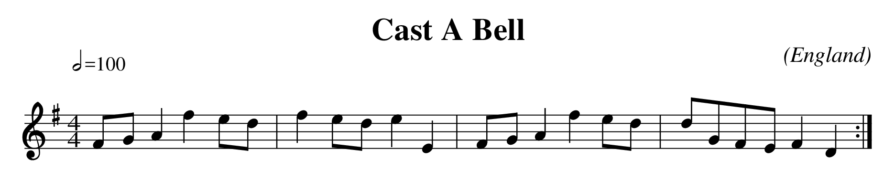

+++++
ABCdb
+++++

ABCdb is a web-based tool for working with music notated in ABC
format, providing database, rendering, and analysis functions.

Overview
========

ABC_ is a text-based format for the notation of music. Since becoming
popular in the 1990's as a way for musicians to exchange music via
mailing lists and Usenet, a huge number of musical pieces have been
transcribed in this format. Estimates of the number of songs
available on the web in ABC format today range between 100,000 and
1,000,000.

.. _ABC: http://abcnotation.com/about

For example, the following music notation:

can be written in ABC like this:

  ::

    X:12
    T:Cast A Bell
    M:4/4
    L:1/4
    Q:1/2=100
    O:England
    K:G
    F/G/Afe/d/|fe/d/eE|F/G/Afe/d/|d/G/F/E/FD:|

Because of this popularity and the nature of the format, working
with collections of ABC-format songs presents a number of
challenges:

  * While the text-based form is not difficult to decipher, most
    musicians want the music rendered into standard music notation,
    tablature_, or audio forms.

  * With such a large body of music available, sophisticated search
    capabilities are needed.

  * Many of the thousands of ABC-format songs available deviate from
    the `ABC standard`_, in ways ranging from subtle to major.
    Software for reading ABC must be both resilient to unintentional
    brokenness, and robust against malicious misuse.

  * Because musicians have passed ABC around so freely, often with
    changes, it is not uncommon to find many versions of the same
    song. It is very useful for ABC software to be able to eliminate
    duplicate copies of a song, as well as identify differences in
    song metadata, non-semantic notational differences, and
    differences in the actual notes of the songs.

.. _tablature: https://en.wikipedia.org/wiki/Tablature
.. _`ABC standard`: http://abcnotation.com/wiki/abc:standard

The goal of ABCdb is to provide an easy means for users to store,
search, retrieve, and render songs in ABC format. It is my hope that
ABCdb will provide:

  * A database for storing ABC-format music.

  * Individual user accounts, as well as a guest account.

  * Access controls, configurable for each user, to allow trusted
    users the full capabilities of the system, while avoiding
    problems that could be caused by accidental, intentional, or
    robotic misuse.

  * Preferences, settable on a per-user basis, for such things as
    rendering style and default search interface.

  * Music entry and update facilities, to include a basic text
    editor, file upload, and URL retrieval with optional web-scraping
    ability.

  * Search facilities, beginning with a simple keyword search, and
    later extended to include regular expression searching, and
    searching by attributes such as meter, key, or melodic contour.

  * Retrieval functions, both for single songs, and selected subsets
    of the database.

  * Rendering facilities, for standard music notation, tablature_,
    `Standard MIDI Files`_, and audio files.

.. _`Standard MIDI Files`: https://en.wikipedia.org/wiki/MIDI#Standard_MIDI_files

Possible Feature List
=====================

* CRUD
* Random Tune
* Deduplication
* Render with jcabc/ghostscript: PDF, SVG, PNG, SMF
* Render SMF to audio with fluidsynth or similar
* TuneGraph http://abcnotation.com/searchHelp#TuneGraph (maybe 3-D????)

Architecture
============

Off-the-shelf technologies that are being used:

  * Python 3.5
  * Django 1.10
  * SQLite 3.13.0
  * pytz 2016.10
  * `requests 2.12.5 <https://github.com/kennethreitz/requests>`_
  * `Arpeggio 1.5 <https://github.com/igordejanovic/Arpeggio>`_ PEG parser
  * `Zurb Foundation 6.3.0 <http://foundation.zurb.com/>`_ front-end framework
  * `abcjs 3.0 <https://github.com/paulrosen/abcjs>`_ in-browser ABC renderer

Original software that I have written:

  * The ABCdb Django app, including all models, views, forms, and templates
  * An ABC parser (see below for details)
  * A parse-tree visitor which reconstitutes the ABC in canonical form, for
    de-duplication purposes.
  * As-yet-minimal test coverage.

Off-the-shelf technologies that may be used:

  * MySQL/MariaDB, PostgreSQL for production database use
  * a JavaScript text editor
  * rendering pipeline: jcabc2ps, ghostscript, ImageMagick,
    FluidSynth
  * reStructuredText / DocUtils / Sphinx for documentation

Original software yet to be written:

  * code that drives rendering pipeline

Schema
======

To begin, an explanation of ‘song’ versus ‘instance’ will be useful.
Consider two different pieces of ABC notated-music which produce
indentical renderings. This is possible due to a number of factors
which do not affect the rendered output:

  * Semantically identical but textually different field values
  * Line re-ordering
  * Differences in encoding, e.g. ISO-8859-1 "Latin-1" vs. UTF-8,
    composed vs. decomposed Unicode, or canonically vs. compatibly
    normalized Unicode
  * Differences in orthography, e.g. characters with diacritics vs. their
    ASCII reductions, British vs. American spelling, or differences
    in capitalization
  * Differences in whitespace
  * Comments

In this case each of the two unique pieces of ABC notation is called
an ‘instance’, and both instances describe the same ‘song’, although
likely with different metadata. Storing each ‘instance’ allows the
system to track every variation of a ‘song’; relating each
‘instance’ to a canonical ‘song’ facilitates deduplication.

In order to derive the ‘song’ from an ‘instance’, the ABC is parsed
then reconstituted in a strict way, with all non-essential metadata
stripped, lines canonically reordered, and fields normalized. This
reconstituted ABC is then passed through a cryptographic hash
function (e.g. MD5 or SHA-1), and the resulting digest is considered
the canonical rendering of the ‘song’ expressed by that instance.

Note that the ‘song’ is just the hash, and exists to group musically
identical instances. Visual and audio renderings must be made from
one of the associated instances.

Principal database tables / Django objects:

.. code:: python

  class Song(models.Model):
      digest = models.CharField(max_length=40, unique=True, db_index=True)

  class Instance(models.Model):
      # CREATE TABLE song_instance (song_id INTEGER, instance_id INTEGER);
      # CREATE UNIQUE INDEX song_instance_index ON song_instance (song_id, instance_id);
      song = models.ForeignKey(Song, on_delete=models.PROTECT)
      digest = models.CharField(max_length=40, unique=True, db_index=True)
      text = models.TextField()

  class Title(models.Model):
      # CREATE TABLE title_song (title_id INTEGER, song_id INTEGER);
      # CREATE UNIQUE INDEX title_song_index ON title_song (title_id, song_id);
      songs = models.ManyToManyField(Song)
      title = models.CharField(max_length=80, unique=True, db_index=True)

  class Collection(models.Model):
      # CREATE TABLE collection_instance (collection_id INTEGER, instance_id INTEGER, X INTEGER);
      # !FIX! note the 'X' field! need to add 'through = ' to the ManyToManyField below!
      # https://docs.djangoproject.com/en/1.10/ref/models/fields/#manytomanyfield
      # CREATE UNIQUE INDEX collection_instance_index ON collection_instance (collection_id, instance_id);
      instance = models.ManyToManyField(Instance)
      URL = models.URLField(unique=True)  # 200 char limit

Access Control
==============
* Guest account is read-only, with limited rendering allowance.
* Separate permissions for:

    + Add new song
    + Edit existing song
    + Upload ABC file
    + Fetch ABC URL
    + Render multiple songs at once
    + Render to audio
    + Download multiple songs at once
    + Use advanced search functions

Global Configuration
====================
* Have a 'portfolio/showcase' switch which determines which welcome
  page is presented by default?

Individual Preferences
======================
* Allow configuration of important elements of the jcabc2ps format file used.

Site Map / Hierarchy
====================

* Django admin

* User side:

  ::

    index.html     -- redirects to welcome.html or portfolio.html
    welcome.html   -- welcome page for regular users
    portfolio.html -- introductory page for those evaluating my coding

Shortcomings
============
* As it exists now, the system tracks from where a particular ABC
  instance came, as its 'Collection'. It doesn't keep the original
  ABC file, nor does it record when the file was imported. The
  present 'Collection' information is somewhat useful, but ignores
  the reality that both web resources and local ABC files often
  change over time.

Licenses
========
ABCdb is written and copyrighted by Sean Bolton, and licensed under the
MIT(Expat) license:

  Copyright © 2017 Sean Bolton.

  Permission is hereby granted, free of charge, to any person obtaining
  a copy of this software and associated documentation files (the
  "Software"), to deal in the Software without restriction, including
  without limitation the rights to use, copy, modify, merge, publish,
  distribute, sublicense, and/or sell copies of the Software, and to
  permit persons to whom the Software is furnished to do so, subject to
  the following conditions:

  The above copyright notice and this permission notice shall be
  included in all copies or substantial portions of the Software.

  THE SOFTWARE IS PROVIDED "AS IS", WITHOUT WARRANTY OF ANY KIND,
  EXPRESS OR IMPLIED, INCLUDING BUT NOT LIMITED TO THE WARRANTIES OF
  MERCHANTABILITY, FITNESS FOR A PARTICULAR PURPOSE AND
  NONINFRINGEMENT. IN NO EVENT SHALL THE AUTHORS OR COPYRIGHT HOLDERS BE
  LIABLE FOR ANY CLAIM, DAMAGES OR OTHER LIABILITY, WHETHER IN AN ACTION
  OF CONTRACT, TORT OR OTHERWISE, ARISING FROM, OUT OF OR IN CONNECTION
  WITH THE SOFTWARE OR THE USE OR OTHER DEALINGS IN THE SOFTWARE.

Other software used in ABCdb is licensed under the following licenses:

  * Python: Python Software Foundation License
  * Django: 3-clause BSD license
  * SQLite3: public domain
  * pytz: MIT(Expat) license
  * requests: Apache 2.0 license
  * Arpeggio PEG parser: MIT(Expat) license
  * Zurb Foundation: MIT(Expat) license
  * abcjs: MIT(Expat) license

See the file `LICENSES <../LICENSES>`_ for more information.
