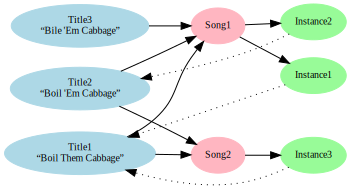

+++++++++++++++++++++++++
ABCdb Project Description
+++++++++++++++++++++++++

ABCdb is a web-based tool for working with music notated in ABC
format, providing database, deduplication, rendering, and analysis functions.

Overview
========

ABC_ is a text-based format for the notation of music. Since becoming
popular in the 1990's as a way for musicians to exchange music via
mailing lists and Usenet, a huge number of musical pieces have been
transcribed in this format. Estimates of the number of songs
available on the web in ABC format today range between 100,000 and
1,000,000.

.. _ABC: http://abcnotation.com/about

For example, the following music notation:

.. image:: Cast_A_Bell.png
   :width: 85%
   :alt: Standard Music Notation

can be written in ABC like this:

  ::

    X:12
    T:Cast A Bell
    M:4/4
    L:1/4
    Q:1/2=100
    O:England
    K:G
    F/G/Afe/d/|fe/d/eE|F/G/Afe/d/|d/G/F/E/FD:|

Because of this popularity and the nature of the format, working
with collections of ABC-format songs presents a number of
challenges:

  * While the text-based form is not difficult to decipher, most
    musicians want the music rendered into standard music notation,
    tablature_, or audio forms.

  * With such a large body of music available, sophisticated search
    capabilities are needed.

  * Many of the thousands of ABC-format songs available deviate from
    the `ABC standard`_, in ways ranging from subtle to major.
    Software for reading ABC must be both resilient to unintentional
    brokenness, and robust against malicious misuse.

  * Because musicians have passed ABC around so freely, often with
    changes, it is not uncommon to find many versions of the same
    song. It is very useful for ABC software to be able to eliminate
    duplicate copies of a song, as well as identify differences in
    song metadata, non-semantic notational differences, and
    differences in the actual notes of the songs.

.. _tablature: https://en.wikipedia.org/wiki/Tablature
.. _`ABC standard`: http://abcnotation.com/wiki/abc:standard

The goal of ABCdb is to provide an easy means for users to store,
search, retrieve, and render songs in ABC format. Currently, ABCdb
provides:

  * A database for storing ABC-format music.

  * Individual user accounts.

  * Access controls, configurable for each user, to allow trusted
    users the full capabilities of the system, while avoiding
    problems that could be caused by accidental, intentional, or
    robotic misuse.

  * Music entry and update facilities, including basic text entry,
    file upload, and URL retrieval.

  * Robust handling of character encodings. Historically, ABC
    notation has been written using many different character
    encodings (ASCII, CP1252, ISO-8859-1, and UTF-8 are common), and
    ABC software has often not handled this well. ABCdb strives to
    properly convert everything to Unicode.

  * Deduplication capability, such that "musically indentical"
    instances of a song can be identified, while retaining the original
    versions for users who wish to explore their differences.

  * Basic search and retrieval facilities.

  * Rendering is done in-browser, using Paul Rosen's
    `abcjs <https://github.com/paulrosen/abcjs>`_.

Features planned for the next development milestone include:

  * Enhanced rendering facilities. Server-side rendering of the ABC
    can produce multiple output formats (PDF, SVG, PNG) in higher
    quality than the in-browser rendering. Other potential features
    include user configurability of the rendering (for example, for
    large-print output), rendering of both standard musical notation
    and tablature, and rendering to `Standard MIDI Files`_ or audio
    files.

  * Stronger deduplication facilities, as well as tools for
    indentifying "near matches".

  * Better search facilities, including full-text keyword search,
    regular expression search, and searching by attributes such as
    meter, key, or melodic contour.

  * Preferences, settable on a per-user basis, for such things as
    rendering style and default search interface.

  * A better text editor for the manual ABC entry.

  * Web-scraping ability, for retrieval of ABC embedded in HTML.

  * An 'de-`mojibake`_-ize' function, which, under a user's guidance,
    will heuristically attempt to undo past misinterpretation
    of ABC character encoding. It is common to find ABC files
    wherein UTF-8 was once misinterpreted as ISO-8859-1 'Latin-1'.

  * Retrieval functions for selected subsets of the database,
    allowing the user to build custom tunebooks.

.. _`Standard MIDI Files`: https://en.wikipedia.org/wiki/MIDI#Standard_MIDI_files
.. _`mojibake`: https://en.wikipedia.org/wiki/Mojibake

Motivation
==========

There are a number of very good ABC-aggregating websites, which
include many of the features of ABCdb. Examples include:

* Chris Walshaw's `ABC Notation Home Page <http://abcnotation.com/>`_

* John Chamber's `ABC Music Collection <http://trillian.mit.edu/~jc/music/abc/>`_

So why create another ABC tool if many others exist? My primary
motivations for ABCdb are:

* That it serve as a vehicle for extending my Python and Django
  skills, and as a demonstration or portfolio project showcasing
  those skills.

* That it be usable as a locally-installable ABC database tool.
  Currently, the best ABC databases are all online tools. ABCdb is
  itself a web application, but it can be easily run using the
  Django development server and a SQLite database, with all required
  components packaged within a single virtualenv.

* That it provide a test bed for research into ABC deduplication.
  Algorithmically determining the similarity of two ABC songs is a
  tricky problem, and recent advances in data mining and machine
  learning hold promise here.

* I wanted a tool that I could be sure was handling character
  encodings as intelligently as possible. I've too often seen titles
  or lyrics savaged by software that does not handle this well.

* As a musician, I am eager to have a good tool to manage my
  personal collection of some 30,000 ABC songs!

Songs, Instances, and Titles
============================

Before exploring how ABCdb is used, it is helpful to explain the difference
between 'songs, 'instances', and 'titles'.  Consider two pieces of ABC
notated-music, which are different, but which a musician would consider to
express the same 'song'. This is possible because many aspects of ABC don't
effect the music itself. For example, different titles could be given to the
same song, or perhaps there are differences in spelling or whitespace.
Information fields could be given in a different order, yet indicate the same
result. (For further explanation of the possibilities, see `Database Schema`_
below).

We call these two different pieces of ABC music two 'instances' which
express the same 'song'.

To complicate matters, one instance of a song may have several titles, and
any one title may be found in many different instances.  So, 'songs',
'instances', and 'titles' are separate entities within the ABCdb database.
Songs group like instances together, and titles are our most common means for
finding the songs we're looking for.

In the diagram above, notice how each title links to the *songs* in whose
instances the title was found. This is because we typically want to find all
the instances of a song that were ever labelled with a particular title, even
if a particular instance didn't contain that title (it's the same song,
remember?) This may seem confusing at first, but with use it starts to feel
natural.

Notice also that each instance links back to its first or primary title (the
dashed lines in the diagram above.) When working with instances, this helps
them appear less anonymous.

Installation
============

For information on installing ABCdb, see the `README
<README.html#installation>`_.

Usage
=====

I will assume that the reader is comfortable using typical web applications, and not describe
every step in detail.

The installation process described in the `README <README.html#installation>`_ creates an 'admin'
user, and for installations with only one user, it is fine to just use this. If you wish to have
more than one user, first log in as 'admin', then access the administration console by selecting
the 'admin' link in the left-margin menu.

To load content into the database, select the 'upload' link. Here you may upload ABC-format files
from your local machine, or if you are logged in as the administrative user, you may fetch them
from a remote URL.

Any errors in the imported file will be shown in the upload progress screen. Deduplication is
performed automatically as part of the upload process.

Songs may be searched for using the 'search' menu link, or browsed via the 'titles' and
'collections' links.

Architecture
============

ABCdb presents a somewhat simple exterior, yet there is much going on "under
the hood". The pieces of ABCdb that I have written are:

  * The ABCdb Django application, including all models, views, forms, and templates
  * Client-side JavaScript for generating graphs and charts using D3
  * An ABC parser (described in detail below)
  * A parse-tree visitor which reconstitutes parsed ABC in canonical form, for
    de-duplication purposes
  * Test coverage
  * Documentation

Off-the-shelf software that ABCdb uses:

  * `Python 3.5 <https://www.python.org/>`_
  * `Django 1.10 <https:/www.djangoproject.com/>`_
  * `pytz 2016.10 <https://pythonhosted.org/pytz/>`_ (timezone support)
  * `requests 2.12.5 <https://github.com/kennethreitz/requests>`_ (ABC URL fetch)
  * `Arpeggio 1.5 <https://github.com/igordejanovic/Arpeggio>`_ (PEG parser)
  * `Graphviz 0.5.2 <https://github.com/xflr6/graphviz>`_ (Python driver for
    `Graphviz <http://www.graphviz.org/>`_ graph visualization software)
  * `Zurb Foundation 5.4.6 <http://foundation.zurb.com/>`_ (front-end framework)
  * `abcjs 3.0 <https://github.com/paulrosen/abcjs>`_ (in-browser ABC renderer)
  * `D3 4.x <https://d3js.org/>`_ (client-side graphs and charts)
  * `dagre <https://github.com/cpettitt/dagre>`_ and `dagre-d3v4
    <https://github.com/smbolton/dagre-d3v4>`_ (cliend-side tune graph layout)

ABCdb has been tested with both `SQLite 3.13.0 <https://www.sqlite.org/>`_ and
`PostgreSQL 9.6.0 <https://www.postgresql.org/>`_ databases.

Documentation for ABCdb is produced in
`reStructuredText <http://docutils.sourceforge.net/rst.html>`_ markup and
rendered using `Sphinx <http://www.sphinx-doc.org/en/stable/>`_.

Database Schema
===============

First, let us be more precise than the description of 'song', 'instance', and
'title' given `above <#songs-instances-and-titles>`_.

There is a one-to-many relationship between a song and its instances. Each
unique instance of a song describes the same essential music due to a number
of factors which do not affect the rendered output:

  * Semantically identical but textually different field values
  * Line re-ordering
  * Differences in encoding, e.g. ISO-8859-1 "Latin-1" vs. UTF-8,
    composed vs. decomposed Unicode, or canonically vs. compatibly
    normalized Unicode
  * Differences in orthography, e.g. characters with diacritics vs. their
    ASCII reductions, British vs. American spelling, or differences
    in capitalization
  * Differences in whitespace
  * Comments

Storing each instance allows the system to track every variation of a song;
relating each instance to a canonical song facilitates deduplication.

In order to derive the ‘song’ from an instance, the ABC is parsed
then reconstituted in a strict way, with all non-essential metadata
stripped, lines canonically reordered, and fields normalized. This
reconstituted ABC is then passed through a cryptographic hash
function (e.g. MD5 or SHA-1), and the resulting digest is considered
the canonical rendering of the song expressed by that instance.

Note that the ‘song’ is just this hash, and exists to group musically
identical instances. Visual and audio renderings must be made from
one of the associated instances.

The titles of an ABC song are of course found in its instances, yet in ABCdb
titles are linked to *songs* in a many-to-many relationship. For the user,
this results in more natural navigation--for example, if they are looking for
all instances of a song called "Boil Them Cabbage Down", they would not want
to miss one just because it is called "Bile 'Em Cabbace Down". However, it is
still convenient to associate a title with each instance, so each instance has
a one-to-one relationship with its first or primary title.

ABC music is typically uploaded into ABCdb in files, which often contain
multiple song instances. ABCdb tracks where each instance comes from by
linking it to a 'collection'. Note that a particular instance may be seen in
multiple collections, and that a particular collection may contain multiple
instances, so there is a many-to-many relationship between instances and
collections.

Parser
======

The ABC parser is the heart of ABCdb's deduplication ability. ABC notation
grew rather organically, without any sort of formal standard for much of its
early years, and many of the programs written for ABC added their own
extensions to ABC. So parsing ABC is a bit tricky: the grammar is ambiguous,
and many variations must be accounted for.

Here is fairly simple example of what the parser must parse:

  ::

    X:22
    T:Boil 'Em Cabbage Down
    S:The Darlings on The Andy Griffith Show
    M:2/4
    L:1/4
    K:D
    "D"A/2A/4A/4 A/2A/2|"G"B/2B/4B/4 B/2B/2|"D"A/2A/4A/4 A/2F/2|"A7"E2|\
    "D"A/2A/4A/4 A/2A/2|"G"B/2B/4B/4 B/2B/2|"A7"A/2c/4c/4 e/2c/2| [1"D"d2:|
     [2"D"d3/2|:A/2|"D"d/2d/4d/4 f/2A/2|d3/2A/2|"D"d/2d/4d/4 c/2B/2|"A7"A3/2A/2|\
    "D"d/2d/4d/4 d/2d/2|"G"B/2B/4B/4 B/2B/2|"A7"A/2c/4c/4 e/2c/2|"D"d3/2:|

The first six lines are 'information fields', with the first letter of the
line indicating what sort of information it provides about the tune. The last
four lines (not counting the empty line which terminates the tune) are the
'music code', and specify the actual notes and timing of the tune.

This two-part character of ABC tunes led me to design a hybrid parser, with a
hand-written top-down parser to classify the lines of an ABC file, and a
recursive-descent (parsing expression grammar, or PEG) parser to parse the
music code. Some of the reasons behind this design include:

* Writing a parser using traditional tools that use production grammars (e.g.
  BNF) to specify the grammar is (as reported by others) quite a chore because
  of the ambiguity and informality of the ABC specification. In contrast,
  using recognition grammar-based tools (e.g. regular expressions or PEG
  parsers) tends to be much easier for ABC.

* PEG parsers are easy to write!

* Unfortunately, PEG parsers can be slow or use lots of memory, but because of
  the line-oriented nature of ABC, ABCdb can use a PEG parser to parse a line
  at a time (typically less than 100 bytes), with reasonable efficiency.

* An information field may specify (change) the character encoding of the
  following lines. The current ABC specification tries to be clear that most
  of ABC is plain ASCII, except for "text strings" (such as tune titles), for
  which it is recommended that the encoding be specified. The top-half parser
  can respond to these character set changes, allowing it to pass only
  pre-decoded Unicode to the music code PEG parser.

Having the top-half parser handle the character encoding significantly
simplifies the parser as a whole. Because a traditional PEG parser returns no
results until its entire parse completes, the bottom-half PEG parser can't
respond to the encoding directives while parsing. (Some parsers, such as
`funcparselib <https://github.com/vlasovskikh/funcparserlib>`_, allow for
executing certain actions at the time of a rule match, which together with a
carefully constructed grammar, would allow a single parser to parse ABC while
responding to character encoding changes. `Arpeggio
<https://github.com/igordejanovic/Arpeggio>`_, the PEG parser used in ABCdb,
does not (yet) have this ability.)

Licenses
========
ABCdb is written and copyrighted by Sean Bolton, and licensed under the
MIT/Expat license:

  Copyright © 2017 Sean Bolton.

  Permission is hereby granted, free of charge, to any person obtaining
  a copy of this software and associated documentation files (the
  "Software"), to deal in the Software without restriction, including
  without limitation the rights to use, copy, modify, merge, publish,
  distribute, sublicense, and/or sell copies of the Software, and to
  permit persons to whom the Software is furnished to do so, subject to
  the following conditions:

  The above copyright notice and this permission notice shall be
  included in all copies or substantial portions of the Software.

  THE SOFTWARE IS PROVIDED "AS IS", WITHOUT WARRANTY OF ANY KIND,
  EXPRESS OR IMPLIED, INCLUDING BUT NOT LIMITED TO THE WARRANTIES OF
  MERCHANTABILITY, FITNESS FOR A PARTICULAR PURPOSE AND
  NONINFRINGEMENT. IN NO EVENT SHALL THE AUTHORS OR COPYRIGHT HOLDERS BE
  LIABLE FOR ANY CLAIM, DAMAGES OR OTHER LIABILITY, WHETHER IN AN ACTION
  OF CONTRACT, TORT OR OTHERWISE, ARISING FROM, OUT OF OR IN CONNECTION
  WITH THE SOFTWARE OR THE USE OR OTHER DEALINGS IN THE SOFTWARE.

Other software used in or by ABCdb is licensed under the following licenses:

  * Python: Python Software Foundation License
  * Django: 3-clause BSD license
  * SQLite3: public domain
  * PostgreSQL: PostgreSQL License (MIT-like)
  * pytz: MIT/Expat license
  * requests: Apache 2.0 license
  * Arpeggio PEG parser: MIT/Expat license
  * Graphviz python module: MIT/Expat license
  * Zurb Foundation: MIT/Expat license
  * abcjs: MIT/Expat license
  * D3: 3-clause BSD license
  * dagre: MIT/Expat license
  * dagre-d3v4: MIT/Expat license

See the file
`LICENSES <https://github.com/smbolton/abcdb/blob/master/LICENSES>`_ for more
information.
